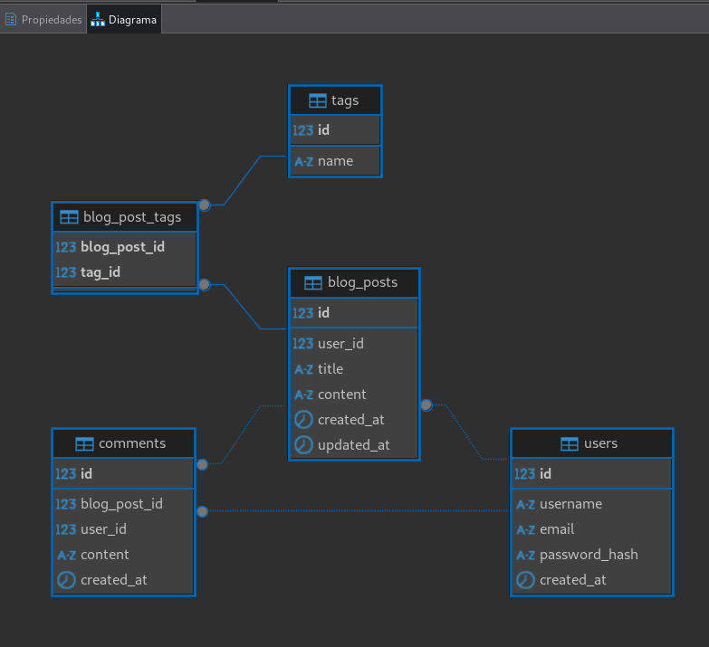
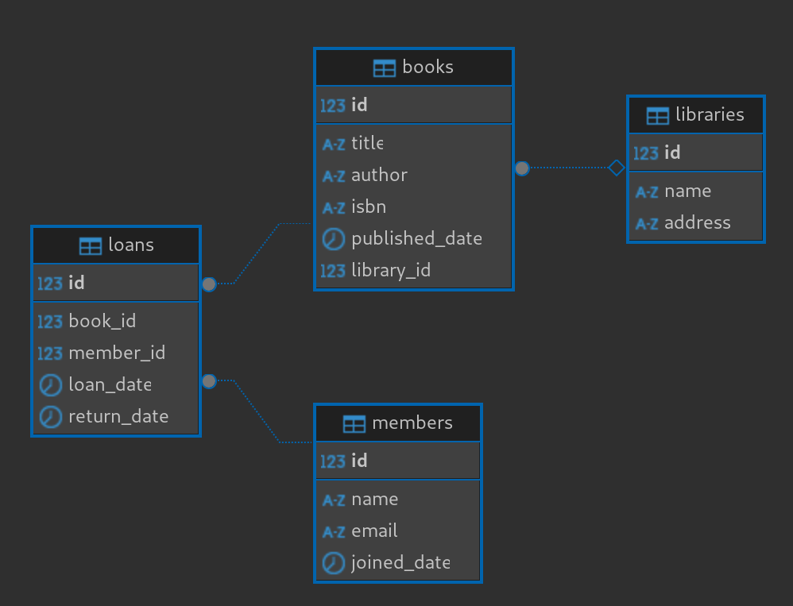

# PUNTOS A DESARROLLAR:
1. Diseñar un esquema de base de datos para una plataforma de blogs sencilla. La
plataforma debe admitir usuarios, publicaciones de blog, comentarios y etiquetas.
2. Escribe una función en lenguaje de su preferencia que tome una lista de enteros y un
entero de destino, y devuelva los índices de los dos números que sumados dan el resultado
del entero destino.
3. Diseñe e implemente un sistema de gestión de bibliotecas sencillo con clases para libros,
bibliotecas y miembros.

## DATABASE SCHEMA


```bash
cd DB_SHEMA
```

Generar la BD con el archivo:
- db_shema.sql

Puede tener datos de prueba:
- seed.sql

### TABLAS
Aquí tienes un esquema de base de datos en SQL para una plataforma de blogs sencilla en PostgreSQL. Este esquema incluye tablas para usuarios, publicaciones de blog, comentarios y etiquetas, con las relaciones necesarias entre ellas.

```sql
-- Crear tabla de usuarios
CREATE TABLE users (
    id SERIAL PRIMARY KEY,
    username VARCHAR(50) NOT NULL UNIQUE,
    email VARCHAR(100) NOT NULL UNIQUE,
    password_hash VARCHAR(255) NOT NULL,
    created_at TIMESTAMP DEFAULT CURRENT_TIMESTAMP
);

-- Crear tabla de publicaciones de blog
CREATE TABLE blog_posts (
    id SERIAL PRIMARY KEY,
    user_id INT NOT NULL,
    title VARCHAR(255) NOT NULL,
    content TEXT NOT NULL,
    created_at TIMESTAMP DEFAULT CURRENT_TIMESTAMP,
    updated_at TIMESTAMP DEFAULT CURRENT_TIMESTAMP,
    FOREIGN KEY (user_id) REFERENCES users (id) ON DELETE CASCADE
);

-- Crear tabla de comentarios
CREATE TABLE comments (
    id SERIAL PRIMARY KEY,
    blog_post_id INT NOT NULL,
    user_id INT NOT NULL,
    content TEXT NOT NULL,
    created_at TIMESTAMP DEFAULT CURRENT_TIMESTAMP,
    FOREIGN KEY (blog_post_id) REFERENCES blog_posts (id) ON DELETE CASCADE,
    FOREIGN KEY (user_id) REFERENCES users (id) ON DELETE CASCADE
);

-- Crear tabla de etiquetas
CREATE TABLE tags (
    id SERIAL PRIMARY KEY,
    name VARCHAR(50) NOT NULL UNIQUE
);

-- Crear tabla intermedia para la relación muchos a muchos entre publicaciones y etiquetas
CREATE TABLE blog_post_tags (
    blog_post_id INT NOT NULL,
    tag_id INT NOT NULL,
    PRIMARY KEY (blog_post_id, tag_id),
    FOREIGN KEY (blog_post_id) REFERENCES blog_posts (id) ON DELETE CASCADE,
    FOREIGN KEY (tag_id) REFERENCES tags (id) ON DELETE CASCADE
);
```

### Explicación:

1. **`users`**: Tabla para almacenar información de los usuarios, como nombre de usuario, correo electrónico y contraseña.
2. **`blog_posts`**: Tabla para las publicaciones de blog, con una relación de uno a muchos con los usuarios.
3. **`comments`**: Tabla para los comentarios, relacionados tanto con las publicaciones como con los usuarios.
4. **`tags`**: Tabla para las etiquetas, con un nombre único.
5. **`blog_post_tags`**: Tabla intermedia para la relación muchos a muchos entre publicaciones y etiquetas.

Este esquema asegura integridad referencial mediante claves foráneas y elimina automáticamente los registros relacionados cuando se elimina un registro principal (`ON DELETE CASCADE`).

## DEVELOPMENT 

```bash
node DEV_EXERCISE/exercise.mjs
```

Para ejecutar los test
```bash
node DEV_EXERCISE/test/exercise.test.mjs
```

## LIBRARY 



### Características del Sistema de Biblioteca

El sistema de biblioteca implementa las siguientes funcionalidades:

- Gestión de libros (agregar, eliminar, buscar)
- Gestión de miembros (registro, préstamos, devoluciones)
- Sistema de préstamos con fechas de devolución
- Búsqueda de libros por título, autor o categoría
- Control de disponibilidad de libros

### Requisitos

- Node.js (versión 14 o superior)
- PostgreSQL (para la base de datos)

### Instalación

1. Moverse en el directorio:

```bash
cd LIBRARY_SYSTEM
```

2. Instalar dependencias:
```bash
npm install
```

## Ejecución del Proyecto

```bash
npm run dev
```
